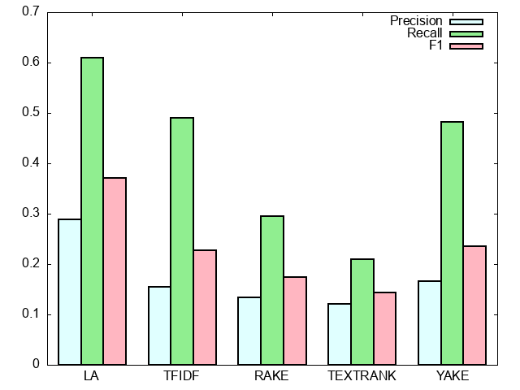

# GP_keyword
Genetic Programming for keyword abstraction

## dataset
`dataset/*.txt` is a collection of sentences, and `dataset/*_keywords.txt` is the collection of keywords.

prese run `dataset/scraper.py` and scrape by youself from these sites:
http://lifehacker.com/
http://www.techcrunch.com

## files
```
KeyGAN_keyword
├dataset
│   ├scraper.py...python code for scraping
│   └separatetestdata.py...python coder for separate dataset
├extraction
│   ├01_LA.py...keyword extraction by linguisitic approach
│   ├02_TFIDF...keyword extraction by TF-IDF
│   ├03_RAKE...keyword extraction by RAKE
│   ├04_TEXTRANK...keyword extraction by TextRank
│   ├05_YAKE...keyword extraction by YAKE
│   ├06_GP...keyword extraction by Genetic Programming
│   ├EvaluateExtraction.py...evaluation of keyword extraction
│   └config.py...config for extraction
├.gitignore
└README.md...this file
```

## usage
```
python -m spacy download en_core_web_sm #for TEXTRANK
```

## results
### extraction

