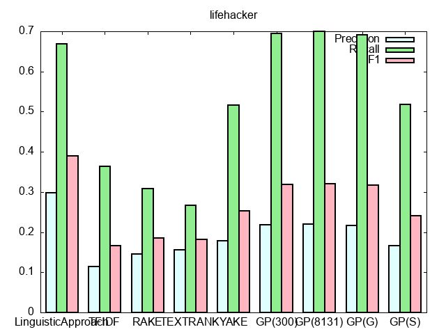
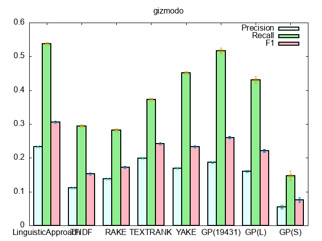
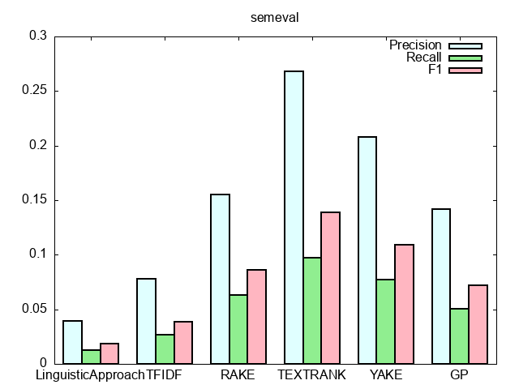

# GP_keyword
methods for keyword abstraction
Genetic programming is here : https://github.com/NaomiatLibrary/gpkex-english


## dataset
`dataset/*.txt` is a collection of sentences, and `dataset/*_keywords.txt` is the collection of keywords.

prese run `dataset/scraper.py` and scrape by youself from these sites:
http://lifehacker.com/
https://gizmodo.com/

## files
```
KeyGAN_keyword
├dataset
│   ├scraper.py...python code for scraping
│   └separatetestdata.py...python coder for separate dataset
├extraction
│   ├01_LA.py...keyword extraction by linguisitic approach
│   ├02_TFIDF...keyword extraction by TF-IDF
│   ├03_RAKE...keyword extraction by RAKE
│   ├04_TEXTRANK...keyword extraction by TextRank
│   ├05_YAKE...keyword extraction by YAKE
│   ├EvaluateExtraction.py...evaluation of keyword extraction
│   └config.py...config for extraction
├.gitignore
└README.md...this file
```

## usage
### make dataset and see statistics
download from [here](https://drive.google.com/drive/folders/1GMX2mHTRldPm7gcpYO4V7XXySuEn7dQO?usp=sharing)
or
```
cd dataset
python scraper.py #scraping
python sentence_tokenizer.py #tokenize text
python keyword_modifier.py #for extracted keyword data
python separatetestdata.py
python makeeachfile.py #for gpkex
python dataset_statistics.py
```
### keyword extraction
```
python -m spacy download en_core_web_sm #for TEXTRANK
python extraction/01_LA.py
python extraction/02_TFIDF.py
python extraction/03_RAKE.py
python extraction/04_TEXTRANK.py
python extraction/05_YAKE.py
```
#### plot results
copy the bottom line from stdout to `extraction/results_(datasetname).csv`, then
```
bash extraction/plot.sh (datasetname)
```
you can see plot from `extraction/results_(datasetname).png`

## results
### extraction
lifehacker:

gizmodo:

semeval:

## dataset statistics
### lifehacker
```
#sentences in lifehacker
mean length:	9.084666039510818
max length:	41 (cyanogenmod, our favorite android rom, has expanded into its own company, cyanogen inc. they'll be launching an app that simplifies the installation process, new features, and aiming to update more devices faster. check out their full blog post for more information.)
min length:	2 (google reader)
#keywords in lifehacker
mean:	1.6884000289456544
max:	7
min:	1
```
### lifehacker_all
```
#sentences in lifehacker_all
number of sentences:	19424(test data:	1000)
mean length:	9.039899093904449
max length:	41 (a-la-carte mobile carrier ting announced its new etf relief program. if you break a contract to switch to ting, the carrier will reimburse you up to $75 per line (if you can't get out of the fee yourself). read more here.)
min length:	1 ("persist.")
#keywords in lifehacker_all
mean:	7.552975700164745
max:	95
min:	1
```
### gizmodo
```
#sentences in gizmodo
number of sentences:	25059(test data:	5000)
mean length:	10.076659084560438
max length:	55 (motorola's going to show everyone the new moto x on august 1, in new york. or well, actually, it showed us the phone right there on the invite, on the left. may as well give up all pretense of these things being some big surprise. we'll tell you more about the phone from the event.)
min length:	1 (supergirlifragilisticxenalidocranz)
#keywords in gizmodo
mean:	1.979687936469931
max:	11
min:	1
```
### gizmodo_all
```
#sentences in gizmodo_all
number of sentences:	28517(test data:	5000)
mean length:	10.06711785952239
max length:	55 (motorola's going to show everyone the new moto x on august 1, in new york. or well, actually, it showed us the phone right there on the invite, on the left. may as well give up all pretense of these things being some big surprise. we'll tell you more about the phone from the event.)
min length:	1 (meebo)
#keywords in gizmodo_all
mean:	9.05494967913876
max:	283
min:	1
```
